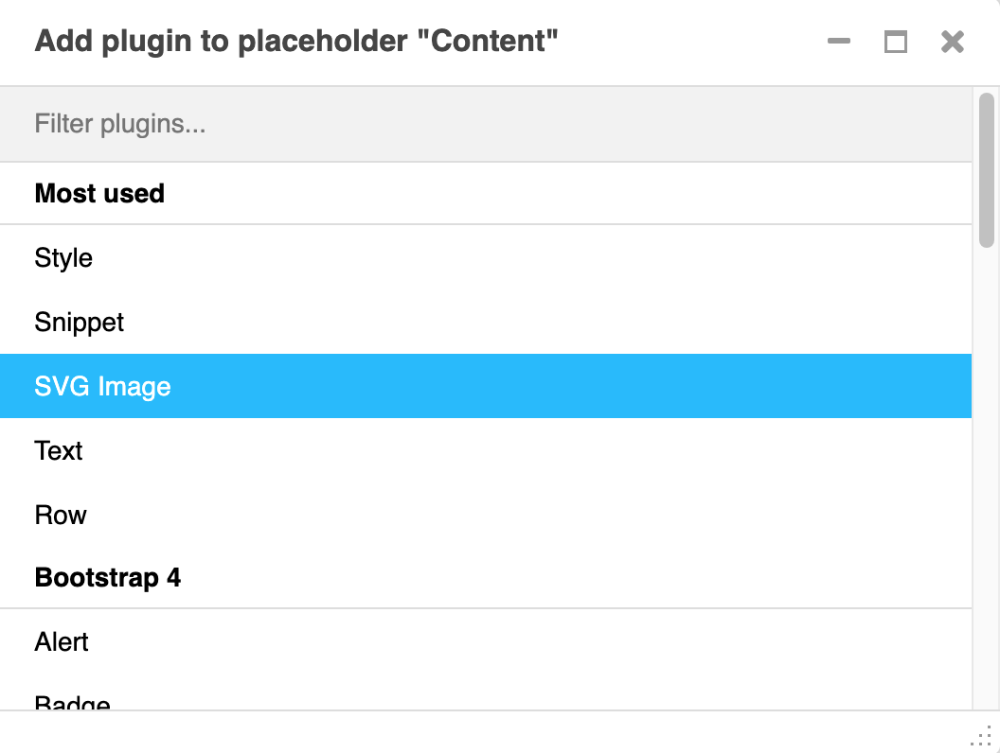
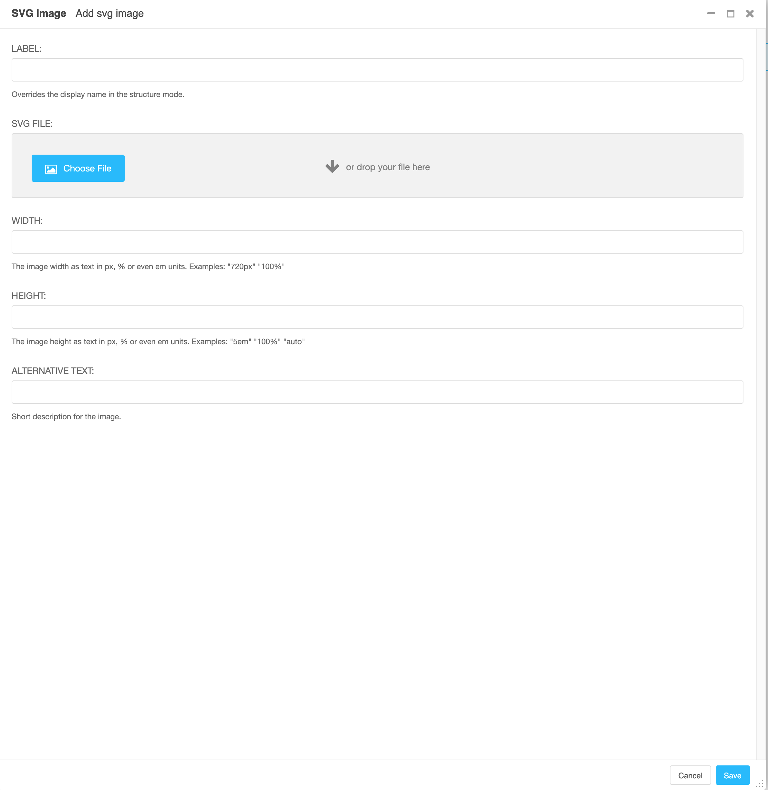

# djangocms SVG Image plugin

Since djangocms_picture pluging do not allow us to use SVG files, we code this small plugin, it is inteded to be very simple but useful to insert SVG images as need it.

## Setup

You can install the plugin by:

1. Executoing the following command:

```bash
pip install git+https://github.com/pablo-pinargote/djangocms_svgimage
```

2. Add the plugin to your CMS INSTALLED_APPS settings variable.

```python
INSTALLED_APPS = [
    ...,
    'djangocms_svgimage',
]
```

3. Executing plugin migrations by issuing the following commands:

```bash
python manage.py makemigrations djangocms_svgimage
python manage.py migrate djangocms_svgimage
```

## Using the plugin

Using the plugin is very straightforward, we just select the plugin from the list, select the file and enter the width and height parameters accordingly.




